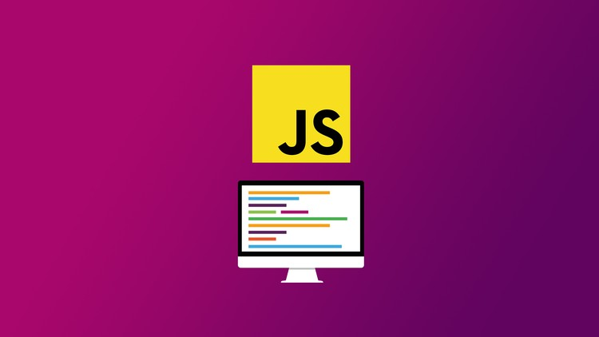

# CURSO DE JAVASCRIPT MODERNO - JUAN PABLO DE LA TORRE - UDEMY - 2024

---

---

### Clase 01

- Nuestro primer Hola Mundo...!
- Manejando archivos esternos JS
- ¿Qué podemos hacer con JS?
- Comentarios de código
- Manejo de la consola (mensajes de error y como es que nos aydua a trabajar nuestro código)
- Consideraciones de JS:
  - El punto y coma al final no es obligatorio, sin embargo se recomienda colocarlo.
  - Usar indentación para tener un código legible.
- ESlint: para solucionar errores de código, nos ayuda con la sintaxis del lenguaje, podemos usar extensiones de nuestro VSCode.

### Clase 02

-
